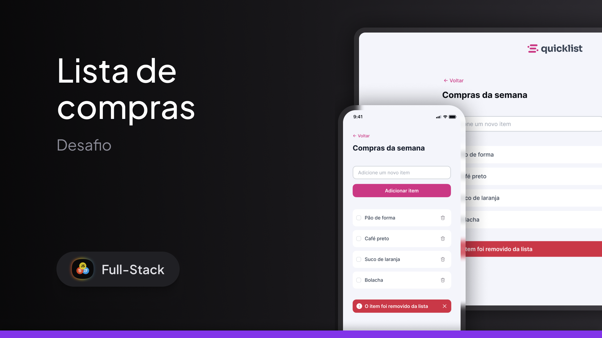
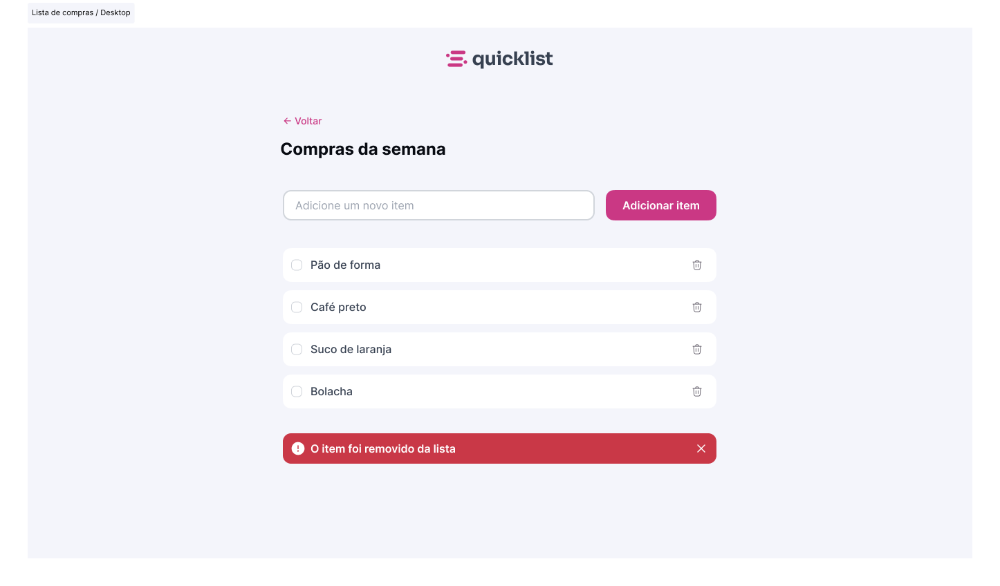
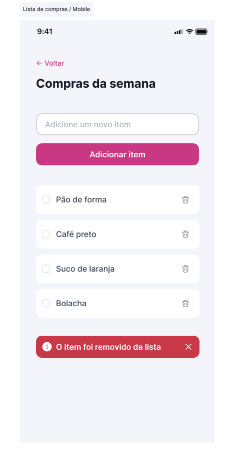

# QuickList - Task Management App

QuickList is a web application for task management, allowing users to efficiently organize their daily activities.



## Layout

| Desktop | Mobile |
|----------|----------|
|  |  |

## 🚀 Features

- Adding new tasks
- Marking tasks as completed
- Deleting tasks
- Responsive and user-friendly interface


## 🛠️ Technologies

- HTML5
- CSS3 (Custom properties, Flexbox, grid, nesting, media queries)
- JavaScript


## 📂 Project Structure

```text
quicklist/
├── assets/
│  └── icons/    # SVG icons
│  └── images/         
├── src/
│   ├── css/
│   │   ├── components.css
│   │   ├── global.css
│   │   ├── index.css
│   │   ├── medias.css
│   │   ├── reset.css
│   │   └── utilities.css
│   └── js/
│       └── index.js
└── .gitignore
└── index.html
└── README.md
```

## 🎨 Design System

The project uses a consistent design system with:

- Typography scale
- Color palette
- Spacing system
- Component patterns

## 💻 Local Development

1. Clone the repository
2. Open `index.html` in your browser
3. Make changes to the code
4. Refresh browser to see updates

## 📱 Responsive Design

The portfolio is fully responsive and optimized for:

- Desktop devices
- Tablets
- Mobile phones

## 📄 License
